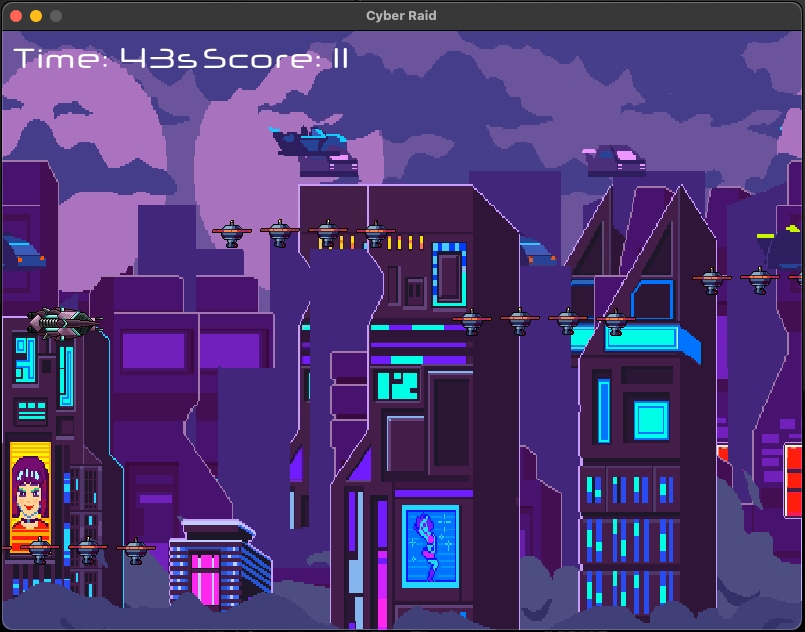
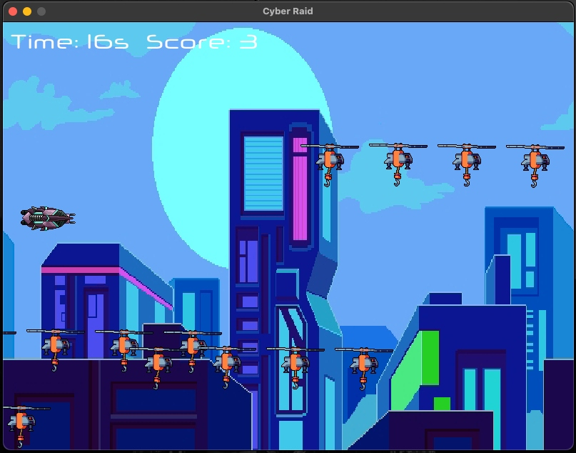

<h1 align="center">👾 Cyber Raid 👾</h1>

Cyber Raid is a 2D arcade-style shooter game developed with Pygame.  
Survive waves of enemies through cyberpunk-themed levels and try to get the highest score.  
Player progress is tracked and ranked using SQLite3. 🕹️

  

  

---

**Python version:** 3.13.1
