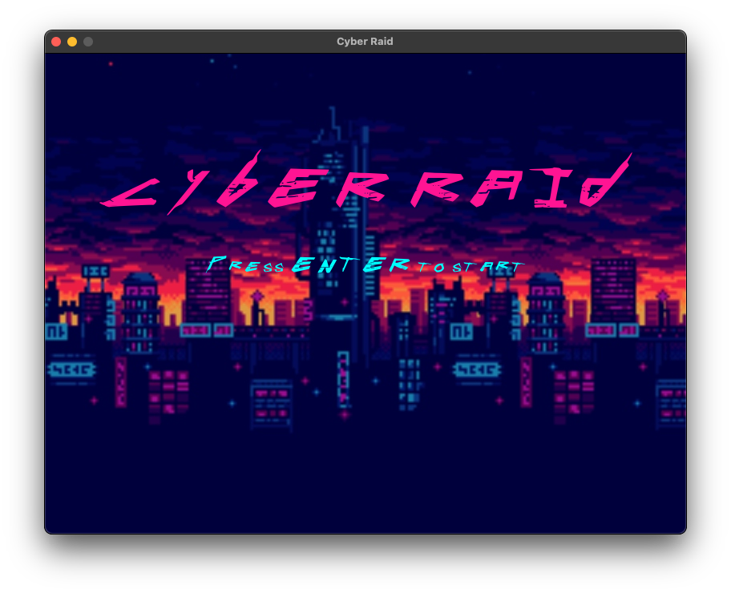
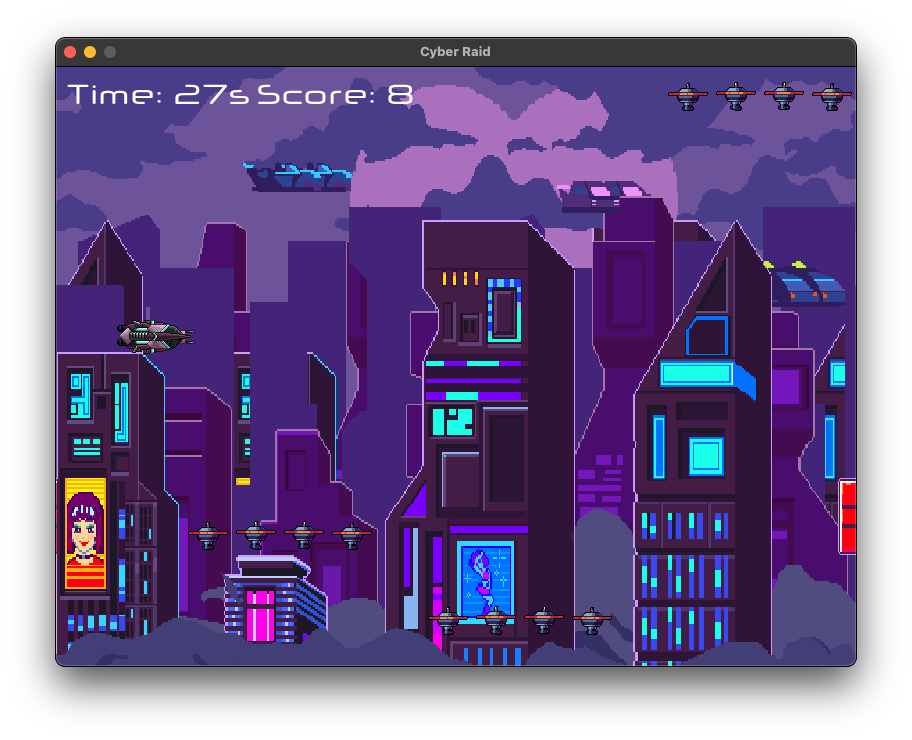
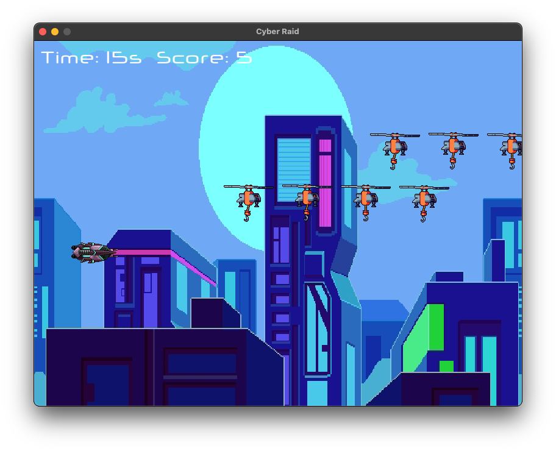
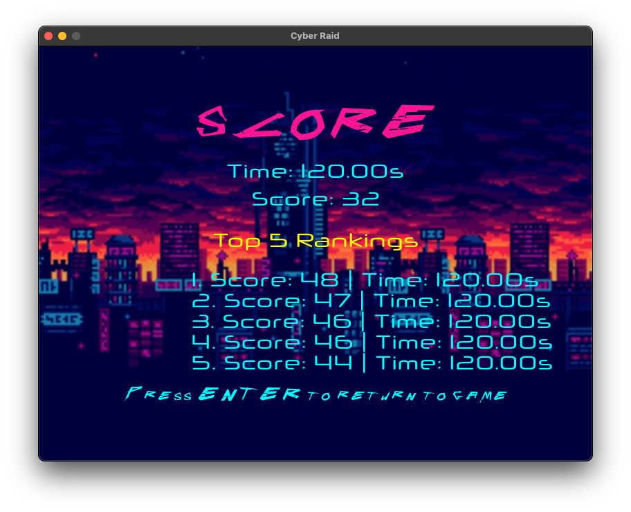

<h1 align="center">👾Cyber Raid👾</h1>

Cyber Raid is a 2D arcade-style shooter game developed with Pygame.  
Survive waves of enemies through cyberpunk-themed levels and try to get the highest score.  
Player progress is tracked and ranked using SQLite3. 🕹️

 

<table>
  <tr>
    <td></td>
    <td></td>
  </tr>
  <tr>
    <td align="center">Main Menu</td>
    <td align="center">Level 1</td>
  </tr>
  <tr>
    <td></td>
    <td></td>
  </tr>
  <tr>
    <td align="center">Level 2</td>
    <td align="center">Score Screen</td>
  </tr>
</table>

 

**Python version**: 3.13.1
